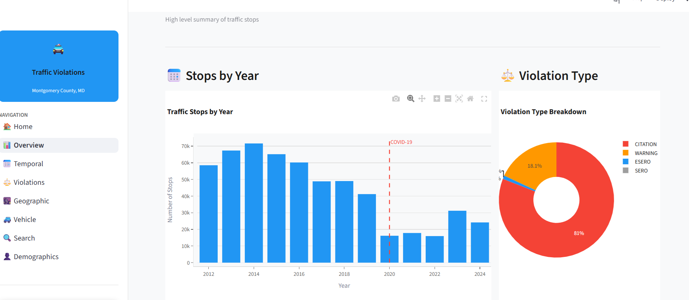
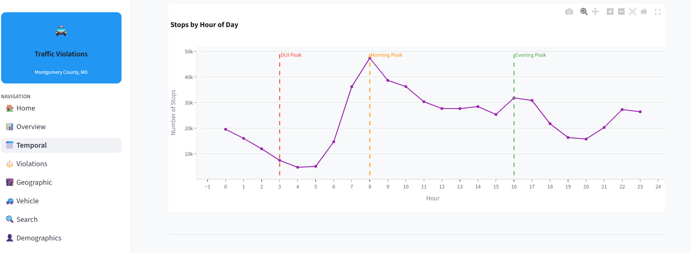
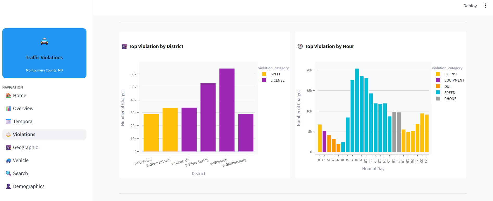

## 🎯 Problem Statement

Traffic violations data is often large, unstructured, and difficult to interpret. This project aims to analyse and visualize traffic violation patterns to uncover meaningful insights that can support better decision-making for road safety and enforcement.

---

## 📊 Key Insights

* 🚗 **Peak Violation Hours**

  * Morning peak around **8 AM**
  * Evening peak around **4 PM**
  * DUI-related violations peak around **3 AM**

* 📍 **High-Violation Locations**

  * District 3 (**Silver Spring**)
  * District 4 (**Wheaton**)
  * District 2 (**Bethesda**)

* ⚠️ **Most Common Violation Types**

  * License-related issues
  * Speeding
  * Mobile phone usage
  * Registration violations
  * Driving Under the Influence (DUI)

* 📅 **Temporal Patterns**

  * Weekdays have **higher violation rates** compared to weekends
  * Violations peak during **summer months (especially May)**
  * Noticeable decline during **winter months**
  * 📉 A significant drop in traffic stops is observed during the COVID-19 period, likely due to reduced mobility, lockdown measures, and changes in enforcement patterns

* 👥 **Demographic Insights**

  * Although most stops involve individuals identified as **White**, higher rates of **searches and arrests** are observed among **Hispanic, Black, and Native American** groups
  * **Male drivers** account for the majority of searches and arrests
  * Notable observation: **Asian women have the lowest search rates** across gender and ethnicity groups

* ⚖️ **Violation Frequency vs Enforcement Severity**

  * While the most common violations include **speeding and license-related issues**, they do not necessarily result in the highest citation rates
  * Violations such as **hit-and-run, reckless driving, insurance-related offenses, and tailgating** show **significantly higher citation rates (above ~80%)**
  * This highlights a clear distinction between **frequent violations** and **high-risk or strictly enforced violations**


---

## 📷 Dashboard Preview

### 🏠 Overview Page



### ⏱️ Temporal Analysis



### 🚓 Violations Analysis



### 🌍 Geographic Insights


---

## 💻 Running Locally

```bash
git clone https://github.com/your-username/traffic-violations-insights.git
cd traffic-violations-insights
pip install -r requirements.txt
streamlit run app/app.py
```
## Dataset

- A **sample dataset** (~10k rows) is included in this repo: `data/Traffic_Violations_sample.csv`  
- **Note:** The full dataset (~1M rows) was used locally for analysis. The sample dataset is included here for demonstration and reproducibility.

👤 Author

Indupriya Chidambararaj
